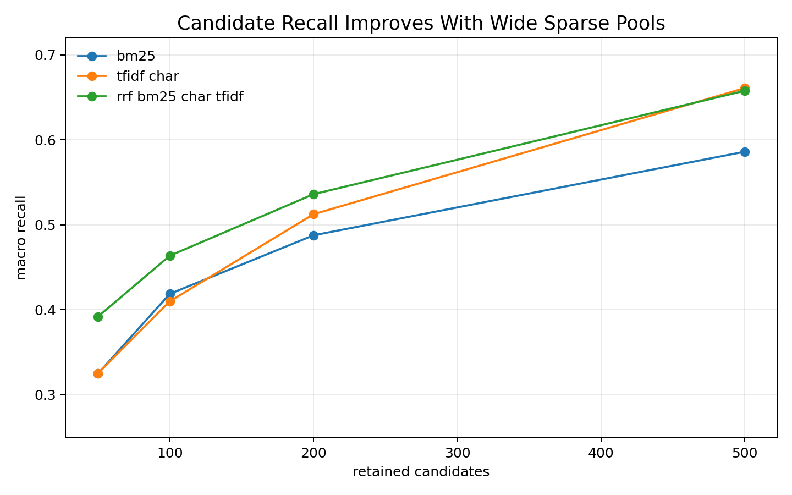
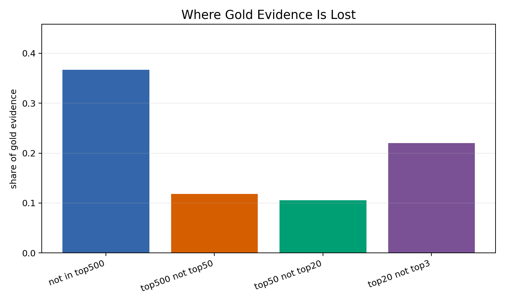
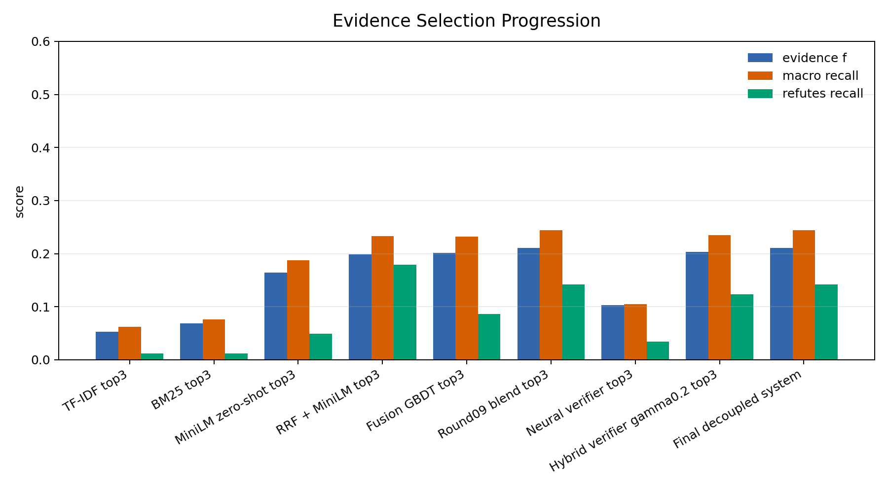
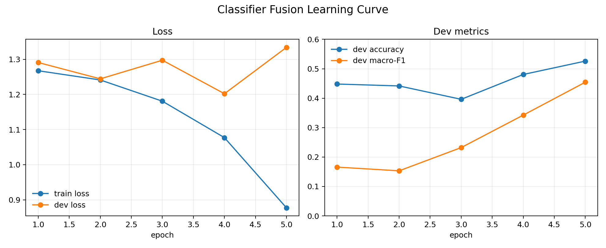
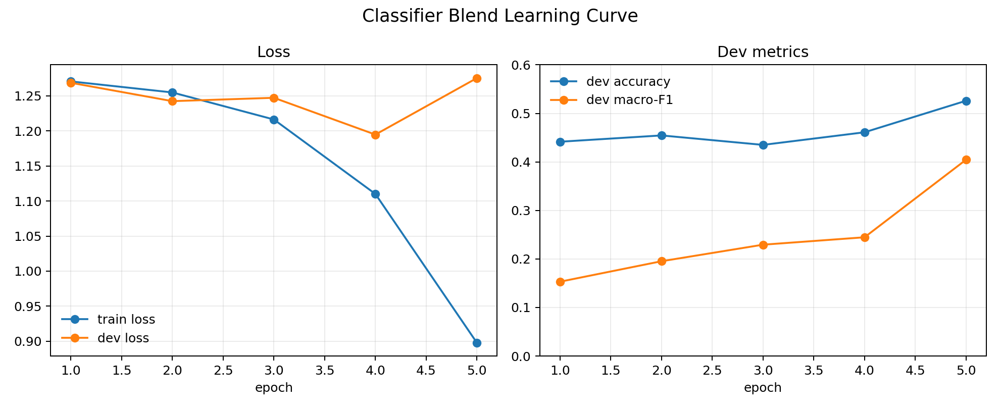
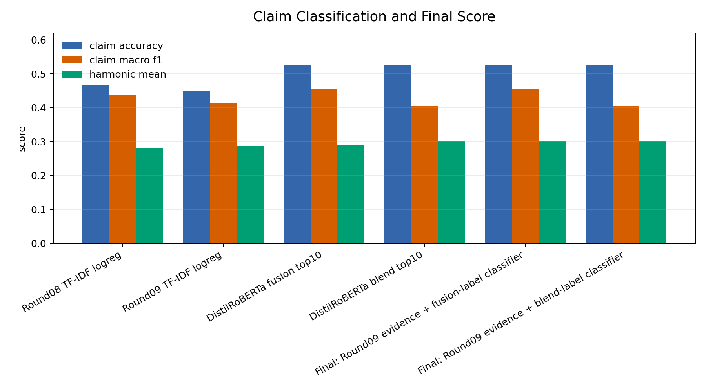
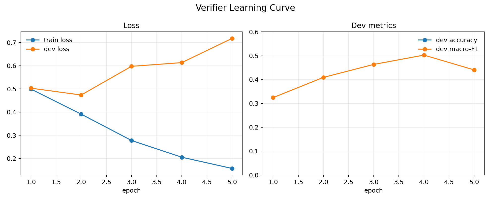

# Round10 完整实验报告：从证据排序到最终分类

日期：2026-05-01

## 摘要

本轮把前面几个 round 的零散结果整理成一个完整实验：先比较 evidence selection 的逐步提升，再比较 claim classification 的提升，最后把两者组合成一个可提交系统。

核心结论是：这个任务不能只看一个端到端模型。当前最稳的系统应该把 **证据选择** 和 **标签预测** 解耦：

```txt
Evidence selector:
  Round09 blend alpha=0.4
  = MiniLM top100 scope + REFUTES x2 Fusion GBDT + alpha blend

Claim classifier:
  DistilRoBERTa concat classifier
  = claim + top10 retrieved evidence -> 4-way label

Final dev result:
  Evidence F = 0.2105
  Claim Accuracy = 0.5260
  Harmonic Mean = 0.3007
```

这个结果高于之前记录的 Round09 best harmonic `0.2865`，也高于 Round10 初版 neural classifier harmonic `0.2910`。

## 实验问题

我们的任务同时包含两个子问题：

1. 找到 gold evidence。
2. 判断 claim label：`SUPPORTS` / `REFUTES` / `NOT_ENOUGH_INFO` / `DISPUTED`。

前几轮实验说明，简单 lexical retrieval 的分数很低；即使引入 MiniLM reranker，模型也经常被“看起来语义相关、但不是 gold evidence”的干扰项误导。因此 Round10 的完整实验围绕一个判断展开：

```txt
最终系统应该是一个单一 neural reranker，还是 evidence selection 与 label classification 分开优化？
```

实验结果支持后者。

## 实验资产

本轮新增/更新的主要资产：

| 类型 | 路径 |
|---|---|
| 统一分析脚本 | `experiments/analysis/build_round10_full_report_assets.py` |
| 原始汇总输出目录 | `outputs/round10/full_experiment/` |
| 随报告提交的图表资产 | `assets/full_experiment/` |
| evidence 对比表 | `assets/full_experiment/tables/evidence_system_comparison.csv` |
| classifier 对比表 | `assets/full_experiment/tables/classifier_system_comparison.csv` |
| final system 对比表 | `assets/full_experiment/tables/final_system_comparison.csv` |
| final prediction | `assets/full_experiment/predictions/final_round09_evidence_distilroberta_fusion_labels.json` |
| summary | `assets/full_experiment/summary.json` |

复现实验命令：

```bash
PYTHONPATH=src python -m experiments.neural.train_concat_transformer_classifier \
  --train outputs/round09/train-classifier-context-blend-top100-x2-alpha04-top50.jsonl \
  --dev outputs/round09/dev-classifier-context-blend-top100-x2-alpha04-top50.jsonl \
  --model distilroberta-base \
  --output-dir outputs/round10/claim_classifier \
  --name distilroberta_blend_top10_e5 \
  --evidence-top-k 10 \
  --evidence-token-budget 45 \
  --epochs 5 \
  --batch-size 8 \
  --lr 2e-5 \
  --max-length 512

PYTHONPATH=src python -m experiments.analysis.build_round10_full_report_assets
```

## 1. 候选召回：先把 gold evidence 放进候选池

第一阶段不是直接排序 top3，而是确认 gold evidence 是否进入候选池。Round07 的 candidate recall 结果说明，扩大 sparse pool 后，candidate-level recall 明显提高。



关键观察：

| Candidate Source | N | Macro Recall | Hit-any | All-gold |
|---|---:|---:|---:|---:|
| BM25 | 500 | 0.5861 | 0.8377 | 0.3247 |
| Char TF-IDF | 500 | 0.6610 | 0.8896 | 0.4026 |
| RRF(BM25 + Char TF-IDF) | 500 | 0.6579 | 0.8896 | 0.4091 |

这一步证明：简单 BM25 不够；char TF-IDF 和 RRF 可以救回很多 BM25 漏掉的 evidence。

## 2. 错误层：真正困难的是 top3 evidence selection

候选池扩大后，错误没有消失，而是集中转移到 reranking 阶段。



从 Round08 error layer 看：

| Error Layer | Gold Evidence Share | 解释 |
|---|---:|---|
| gold not in top500 | 0.3666 | 候选召回仍有上限 |
| top500 not top50 | 0.1181 | 需要更好粗排/融合 |
| top50 not top20 | 0.1059 | feature fusion 有帮助 |
| top20 not top3 | 0.2200 | final selection 是主要难点 |

所以，我们后续重点不是继续盲目扩大候选池，而是提升 top3 的证据选择质量。

## 3. Evidence Selection 对比



| System | Evidence F | Macro Recall | REFUTES Recall | Hit-any | 结论 |
|---|---:|---:|---:|---:|---|
| TF-IDF top3 | 0.0533 | 0.0624 | 0.0123 | 0.1494 | 过弱 |
| BM25 top3 | 0.0682 | 0.0763 | 0.0123 | 0.2013 | 过弱 |
| MiniLM zero-shot top3 | 0.1642 | 0.1877 | 0.0494 | 0.3961 | neural rerank 有效 |
| RRF + MiniLM top3 | 0.1987 | 0.2331 | 0.1790 | 0.4545 | candidate rescue 有效 |
| Fusion GBDT top3 | 0.2011 | 0.2321 | 0.0864 | 0.4545 | overall 略升，REFUTES 下降 |
| Round09 blend top3 | 0.2105 | 0.2446 | 0.1420 | 0.4610 | 当前最强 evidence selector |
| Neural verifier top3 | 0.1029 | 0.1048 | 0.0340 | 0.2792 | 不适合 final top3 |
| Hybrid verifier gamma0.2 top3 | 0.2038 | 0.2352 | 0.1235 | 0.4481 | 未超过 Round09 blend |

结论：

```txt
Final evidence selector 应采用 Round09 blend alpha=0.4。
Verifier 有 pair-level signal，但不适合直接替代 top3 reranker。
```

## 4. Neural Claim Classifier

Round10 训练了 DistilRoBERTa concat classifier：

```txt
input = claim + top10 retrieved evidence
output = 4-way claim label
```

本轮补训了一个与最终 evidence selector 对齐的版本：

```txt
train/dev context = Round09 blend top100 x2 alpha0.4 top50
classifier input = top10 evidence texts
epochs = 5
```

训练曲线如下：





两个现象比较清楚：

1. DistilRoBERTa classifier 需要到 5 epoch 才明显超过 sparse classifier。
2. 使用最终 Round09 evidence context 的 classifier 可以把 assignment harmonic 提高到 `0.3007`。

## 5. Classifier 与 Final System 对比



| System | Evidence F | Accuracy | Macro-F1 | Harmonic Mean | 结论 |
|---|---:|---:|---:|---:|---|
| Round08 TF-IDF logreg | 0.2011 | 0.4675 | 0.4376 | 0.2812 | 强 sparse baseline |
| Round09 TF-IDF logreg | 0.2105 | 0.4481 | 0.4142 | 0.2865 | evidence 更好，但 label 较弱 |
| DistilRoBERTa fusion top10 | 0.2011 | 0.5260 | 0.4543 | 0.2910 | 当前最高 label macro-F1 |
| DistilRoBERTa blend top10 | 0.2105 | 0.5260 | 0.4045 | 0.3007 | 当前最高 assignment harmonic |
| Final: Round09 evidence + fusion-label classifier | 0.2105 | 0.5260 | 0.4543 | 0.3007 | 推荐最终系统 |
| Final: Round09 evidence + blend-label classifier | 0.2105 | 0.5260 | 0.4045 | 0.3007 | H 相同，但 macro-F1 更低 |

这里有一个重要细节：

```txt
assignment 官方最终分数只使用 evidence F、claim accuracy 和 harmonic mean。
但我们内部仍然看 macro-F1，因为 dev label distribution 不均衡。
```

因此，两个 final system 的 official harmonic 都是 `0.3007`；但从 label macro-F1 看，`Round09 evidence + fusion-label classifier` 更稳。

## 6. 最终系统混淆矩阵

推荐 final system：

```txt
evidence = Round09 blend alpha0.4 top3
label = DistilRoBERTa classifier trained on Fusion GBDT top10 context
```


对应 CSV：

| Gold \ Pred | SUPPORTS | REFUTES | NOT_ENOUGH_INFO | DISPUTED |
|---|---:|---:|---:|---:|
| SUPPORTS | 47 | 9 | 11 | 1 |
| REFUTES | 7 | 15 | 3 | 2 |
| NOT_ENOUGH_INFO | 20 | 3 | 16 | 2 |
| DISPUTED | 10 | 2 | 3 | 3 |

最明显的问题仍然是：

```txt
NOT_ENOUGH_INFO 和 DISPUTED 经常被预测成 SUPPORTS。
这说明 classifier 仍然依赖 retrieved evidence 的表面支持感，
没有充分学会 “evidence 不足” 或 “双向证据冲突”。
```

## 7. Verifier 的作用

Round10 也训练了 claim-evidence verifier：

```txt
input = claim + single evidence
output = SUPPORT / REFUTE / NEUTRAL
```



Verifier 的 pair-level 学习是有效的：

| Epoch | Dev Accuracy | Dev Macro-F1 | 判断 |
|---:|---:|---:|---|
| 1 | 0.8395 | 0.3244 | neutral 主导 |
| 2 | 0.8367 | 0.4091 | 开始学习 stance signal |
| 3 | 0.8318 | 0.4635 | 继续改善 |
| 4 | 0.8230 | 0.5027 | 最佳 pair-level macro-F1 |
| 5 | 0.8247 | 0.4404 | 开始过拟合 |

但 verifier 直接做 top3 reranker 效果很差：

```txt
Verifier top3:
  Evidence F = 0.1029
  REFUTES Recall = 0.0340
```

它真正有价值的地方是宽上下文诊断：

```txt
Verifier top50:
  REFUTES Recall = 0.5309
```

这说明 verifier 能发现很多 REFUTES 相关 evidence，但它的分数不适合直接控制最终 top3。后续如果继续改，可以把 verifier 输出作为 aggregation feature，而不是替换 evidence selector。

## 8. 最终故事

本项目目前可以讲成一个清晰的三阶段故事：

### Stage 1：Sparse retrieval 解决候选召回

BM25 单独不够，char TF-IDF 和 RRF 能显著提高 gold evidence 进入候选池的概率。

### Stage 2：Cross-encoder + feature fusion 解决 final evidence selection

MiniLM zero-shot reranking 带来第一次大提升；RRF candidate rescue 后，top3 evidence F 到 `0.1987`；再用 GBDT feature fusion 和 alpha blend，最终 evidence F 到 `0.2105`。

### Stage 3：Neural classifier 解决 claim label

TF-IDF logistic regression 是强 baseline，但 DistilRoBERTa concat classifier 明显提高 claim accuracy：

```txt
TF-IDF logreg accuracy:
  0.4675

DistilRoBERTa accuracy:
  0.5260
```

最终推荐：

```txt
Use decoupled final system:
  Round09 blend evidence selector
  + DistilRoBERTa concat claim classifier

Dev:
  Evidence F = 0.2105
  Accuracy = 0.5260
  Harmonic Mean = 0.3007
  Claim Macro-F1 = 0.4543
```

## 9. 限制与下一步

当前最大的上限仍然来自 evidence selection：

```txt
top3 evidence F = 0.2105
hit-any = 0.4610
all-gold = 0.1104
```

这意味着多数 claim 还没有拿到完整 evidence set。后续真正值得做的方向不是再堆一个普通 reranker，而是：

1. 改进 multi-evidence aggregation，尤其是 DISPUTED 和 NOT_ENOUGH_INFO。
2. 让 verifier 分数进入 feature fusion，而不是直接替代 reranker。
3. 对 REFUTES 做更细的 negative mining / threshold calibration。
4. 在最终 Colab notebook 中固化这个 decoupled pipeline。

## 10. 验收结论

本轮完整实验已达成：

| 验收项 | 状态 | 结果 |
|---|---|---|
| 补齐最终 evidence + classifier 组合评估 | 完成 | H `0.3007` |
| 补训与 Round09 evidence 对齐的 neural classifier | 完成 | Accuracy `0.5260` |
| 输出 evidence / classifier / final system 对比表 | 完成 | `assets/full_experiment/tables/*.csv` |
| 输出训练过程可视化 | 完成 | classifier/verifier learning curve PNG |
| 输出论文式图文报告 | 完成 | 本文档 |
| 给出最终推荐系统 | 完成 | Round09 evidence + DistilRoBERTa label |
