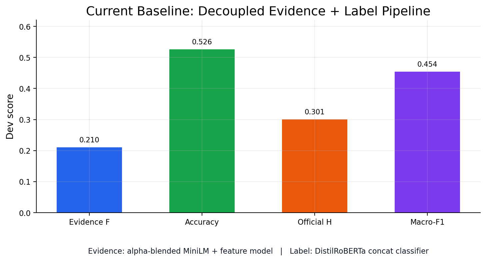
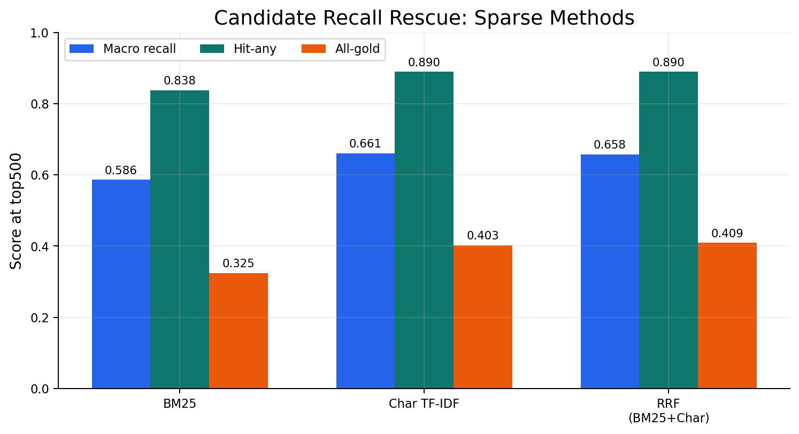
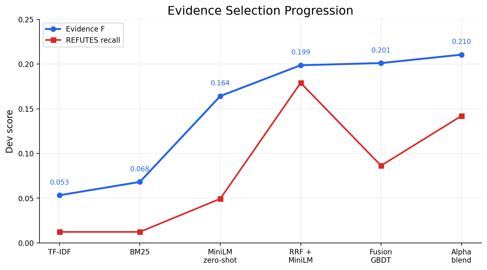
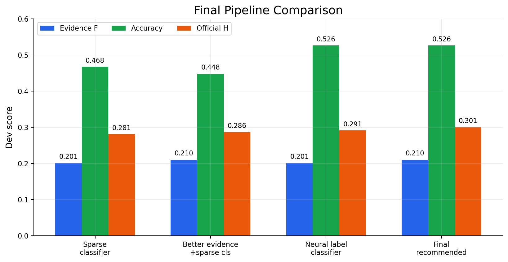
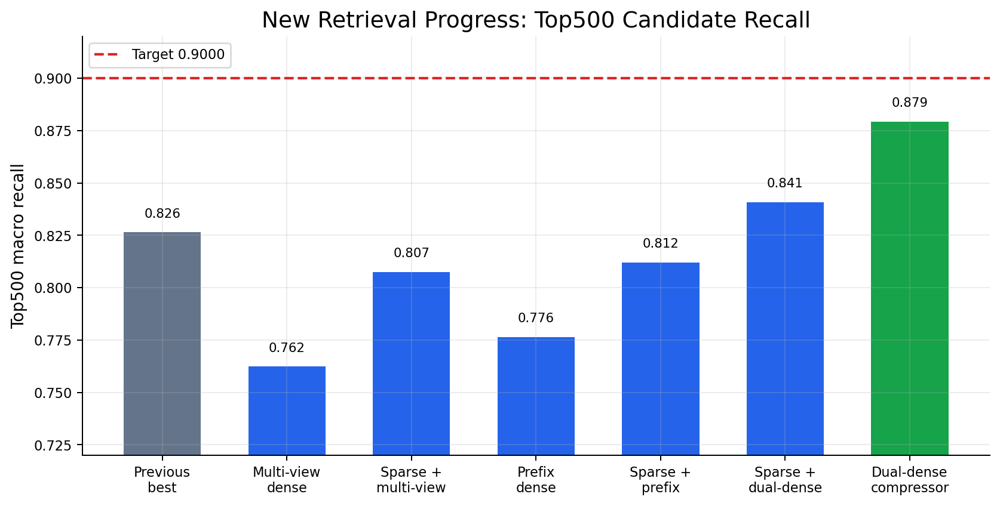
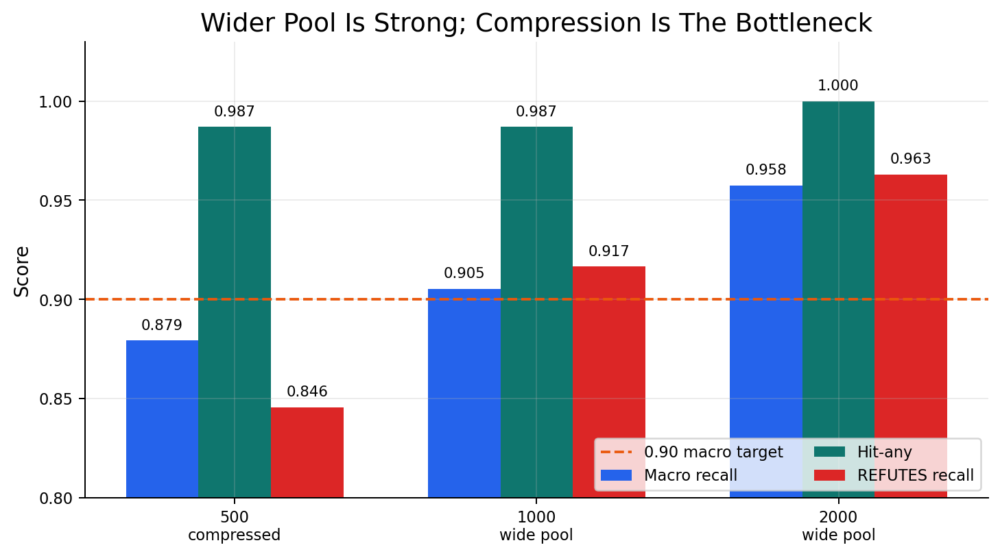
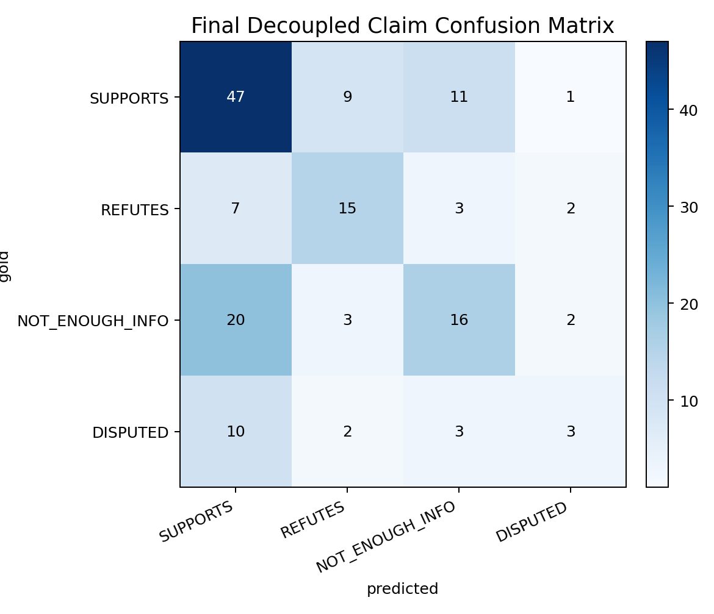
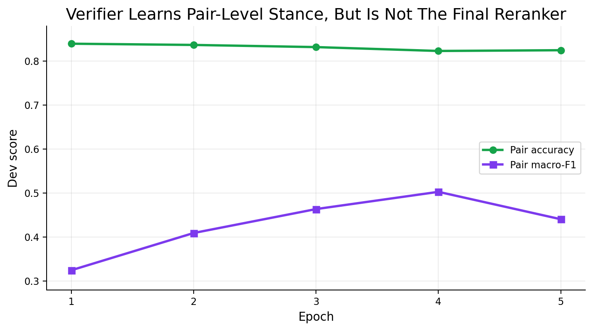

# Purpose

This meeting pack summarizes the current Assignment 3 fact-checking system. It is written for group discussion: what baseline we have, what has improved, where the system still fails, and what we should do next.

# Executive Summary

The task has two different subproblems:

1. retrieve the correct gold evidence;
2. predict the claim label: `SUPPORTS`, `REFUTES`, `NOT_ENOUGH_INFO`, or `DISPUTED`.

Our current strongest pipeline separates those two steps:

```text
Evidence selector:
  alpha-blended MiniLM reranker + feature-fusion ranking model

Claim classifier:
  DistilRoBERTa concat classifier
  input = claim + top10 retrieved evidence
```

{width=92%}

This is the strongest current dev result among the tested pipelines:

```text
Evidence F = 0.2105
Claim accuracy = 0.5260
Official harmonic mean = 0.3007
Claim macro-F1 = 0.4543
```

After establishing this baseline, the next step is targeted improvement rather than broad model search. The first target is top500 candidate recall: before the final ranker can choose the best top3 evidence, the gold evidence must appear in the candidate pool. Our newest retrieval experiment improves top500 macro recall from `0.8264` to `0.8793`.

\newpage

# 1. Candidate Recall

The first retrieval question is whether gold evidence enters the candidate pool at all. BM25 alone is not enough; character TF-IDF and reciprocal-rank fusion recover more gold evidence.

{width=92%}

Key takeaway:

```text
BM25 top500 macro recall:          0.5861
Char TF-IDF top500 macro recall:   0.6610
RRF top500 macro recall:           0.6579
```

The important gain is not only macro recall. RRF also improves all-gold coverage, meaning more claims have their full evidence set available somewhere in the candidate pool.

# 2. Evidence Selection

After candidate recall improves, the main bottleneck becomes final top3 evidence selection. The system improves sharply when moving from sparse retrieval to MiniLM reranking, then improves again with candidate rescue and feature fusion.

{width=94%}

Main observations:

1. Sparse top3 retrieval is too weak for final evidence output.
2. MiniLM zero-shot reranking gives the first major improvement.
3. Candidate rescue plus feature fusion makes the final top3 selector stronger.
4. The current best evidence selector is the alpha-blended MiniLM + feature model, with `Evidence F = 0.2105`.

The verifier has useful pair-level signal, but it does not replace the final top3 evidence selector.

\newpage

# 3. Claim Classification

For claim labels, the sparse classifier is a strong baseline, but the neural concat classifier gives better accuracy.

```text
DistilRoBERTa classifier input:
  claim + top10 retrieved evidence texts

Output:
  SUPPORTS / REFUTES / NOT_ENOUGH_INFO / DISPUTED
```

{width=96%}

Important details:

1. The official score uses evidence F, claim accuracy, and their harmonic mean.
2. We still track macro-F1 because the dev label distribution is imbalanced.
3. Two final variants have the same official harmonic score, but the recommended one has higher macro-F1.

Recommended current pipeline:

```text
evidence = alpha-blended MiniLM + feature model top3
label    = DistilRoBERTa classifier trained with feature-fusion context
```

# 4. New Progress: Top500 Candidate Recall

Once the current baseline was established, we moved to targeted retrieval improvement:

```text
Goal:
  recover more gold evidence before final top3 selection

Target:
  top500 candidate macro recall = 0.9000
```

We tested multi-view dense retrieval, query-prefix dense retrieval, sparse + dual-dense fusion, and a recall-oriented compressor that selects 500 candidates from a wider top2000 pool.

{width=96%}

The improvement is meaningful:

```text
Previous best top500 macro recall = 0.8264
Current best top500 macro recall  = 0.8793
Absolute gain                     = +0.0529
Remaining gap to 0.9000 target    = 0.0207
```

The best current top500 candidate method is:

```text
Sparse + dual-dense candidate pool
+ text-feature HistGBDT compressor
```

\newpage

# 5. What The New Retrieval Result Means

The wider candidate pool is now strong enough. At top1000 and top2000, the sparse + dual-dense pool already reaches or exceeds the `0.9000` macro-recall target.

{width=92%}

This changes the next technical problem:

```text
Old question:
  Can we find the gold evidence at all?

Current question:
  Can we compress top1000/top2000 down to top500 without dropping gold evidence?
```

Practical takeaway:

```text
Do not replace the final evidence selector yet.
Treat this as candidate acquisition progress and the next path toward stronger top3 evidence selection.
```

# 6. Remaining Label Errors

The recommended final system still has a clear label-side weakness.

{width=72%}

The main issue is:

```text
NOT_ENOUGH_INFO and DISPUTED are often predicted as SUPPORTS.
```

This suggests the classifier still relies too much on surface-level support signals in retrieved evidence. It has not fully learned evidence insufficiency or two-sided evidence conflict.

\newpage

# 7. Verifier Role

We also trained a claim-evidence verifier:

```text
input  = claim + one evidence sentence
output = SUPPORT / REFUTE / NEUTRAL
```

{width=88%}

The verifier learns pair-level stance signal, but direct verifier top3 ranking is weak:

```text
Verifier top3:
  Evidence F = 0.1029
  REFUTES recall = 0.0340

Verifier top50:
  REFUTES recall = 0.5309
```

Conclusion: the verifier is useful as a diagnostic or future fusion feature, not as a direct replacement for the evidence selector.

# 8. Project Story

The project can now be explained as a three-stage progression.

```text
Stage 1: Candidate recall
  BM25 is not enough.
  Char TF-IDF, dense retrieval, and fusion improve candidate coverage.

Stage 2: Top3 evidence selection
  MiniLM reranking helps.
  Feature fusion and alpha blending give the current best evidence selector.

Stage 3: Claim label prediction
  Sparse logistic regression is a strong baseline.
  DistilRoBERTa improves claim accuracy and final official score.
```

Current recommendation:

```text
Use the decoupled final system:
  alpha-blended evidence selector
  + DistilRoBERTa concat claim classifier
```

# 9. Next Steps

The highest-value next steps are:

1. improve top500 compression from wider top1000/top2000 candidate pools;
2. improve multi-evidence aggregation, especially for `DISPUTED` and `NOT_ENOUGH_INFO`;
3. add verifier scores into feature fusion instead of using the verifier as a direct reranker;
4. tune `REFUTES` negative mining or threshold calibration;
5. freeze the final pipeline into the submission notebook.

Meeting decisions:

```text
Final evidence selector:
  alpha-blended MiniLM + feature model

Final label classifier:
  DistilRoBERTa concat classifier

New retrieval progress:
  top500 macro recall improved from 0.8264 to 0.8793

Main implementation priority:
  improve top500 compression and stabilize the final notebook
```
